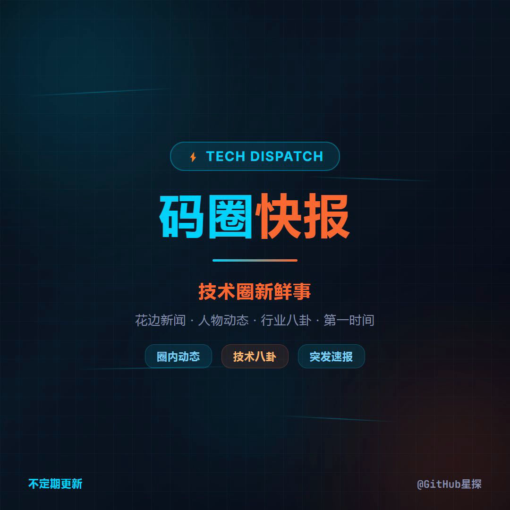
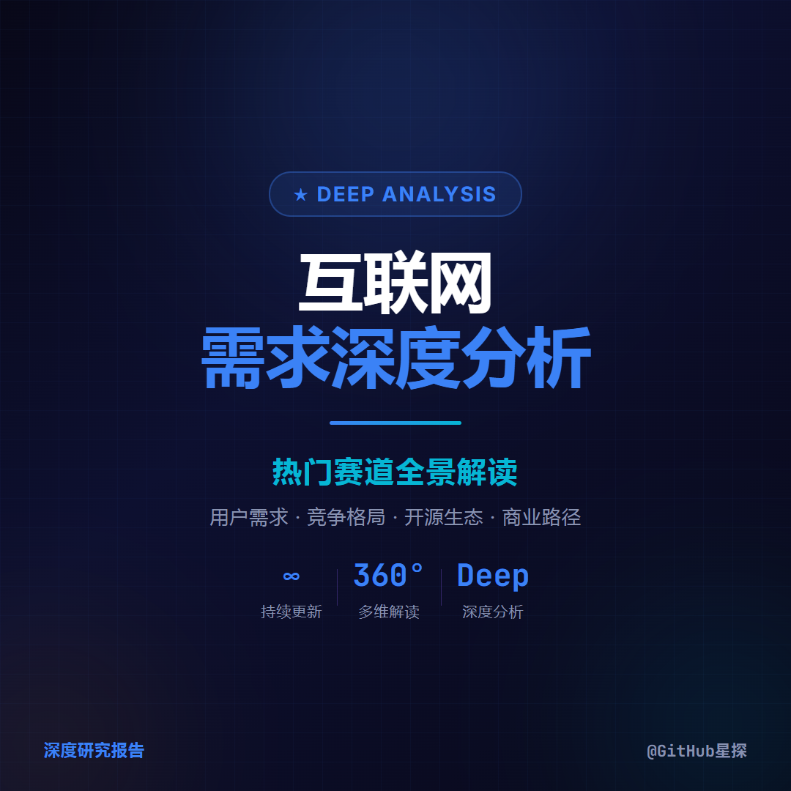

<div align="center">

# ClipForge

### 把知识变成短视频

告诉它你想讲什么，它帮你写稿、配音、做画面、出成片。

[](LICENSE)

</div>

<div align="center">

| | | |
|:---:|:---:|:---:|
|  |  |  |
| GitHub 星探 · 每日热门 | 开源亮点 · 单项目深度 | 科技速递 · 行业趋势 |
| | | |
|  |  | |
| 互联网报告 · 深度解读 | 周度汇总 · 一周精选 | |

▲ 以上每一条视频，都是 ClipForge 自动生成的。不是 PPT 翻页，不是图片拼接 — 有动画、有旁白、有配乐，是真正的短视频。

</div>

---

## 它做了什么

三个真实案例。每一行左边的输入，是你给 ClipForge 的话；右边，是它返回给你的成片。

### 案例 1：每日 GitHub 趋势盘点（45 秒）

> **你说的：** 「今天 GitHub 上涨星最快的项目」
>
> **它做的：** 自动抓取趋势数据 → 筛选涨星最快的项目 → 编写文案 → 配音配乐 → 渲染竖屏视频 → 生成封面和抖音文案
>
> **结果：** 一条 45 秒视频，直接能发。每天 7 点自动执行，全程无需人工介入。

### 案例 2：AI 对企业培训的冲击（55 秒）

> **你说的：** 上传一份 30 页的行业报告 PDF
>
> **它做的：** 提炼核心数据点（4175 亿市场规模、75% 无效培训、AI 增速 4 倍）→ 编写旁白 → 配音 → 配乐 → 渲染成片
>
> **结果：** 55 秒深度分析视频，5 个数据点讲清行业变革。

### 案例 3：WiFi 穿墙感知人体（50 秒）

> **你说的：** 「帮我做一个 RuView 项目的深度解读视频，它用 WiFi 信号穿墙检测人体」
>
> **它做的：** 调研项目原理 → 从技术原理到应用场景拆解成 7 个场景 → 编写文案 → 配音配乐 → 渲染
>
> **结果：** 50 秒单项目深度解析，从「这是什么」到「能用在哪」一气呵成。

看完这三个例子，你是不是在想：**如果我把我的专业领域喂给它，是不是也能做出这样的视频？**

答案是：能。

---

## 你能做什么

ClipForge 不限于技术视频。它的核心能力是把**信息**变成**视频** — 你熟悉什么领域，就做什么领域的视频。

| 如果你研究... | 你可以这样做视频... |
|:---|:---|
| 医学 / 健康科普 | 每周一条医学新知，用数据讲清每个结论 |
| 财经 / 投资 | 每日市场异动速报，用数字说话 |
| 读书 / 知识 | 把一本书的核心观点变成 1 分钟视频 |
| AI / 科技前沿 | 论文速读、产品测评、趋势预测 |
| 教育 / 考研考证 | 知识点拆解，把难懂的概念讲明白 |
| 管理 / 职场 | 方法论拆解、案例复盘、行业分析 |
| 设计 / 审美 | 设计趋势、灵感集、案例分析 |
| 法律 / 政策 | 新法规解读、案例分析 |

**你不需要会剪辑、不需要出镜、不需要配音。你只需要懂一个领域，并且愿意讲出来。**

给 ClipForge 一个想法、一段文字、一份报告、一个 URL — 它都能变成视频。

---

## 它是怎么做到的

整个过程可以理解成三步：

```
你说话 → 它创作 → 出成片
```

**第一步：你说话** — 告诉 ClipForge 你想讲什么。一句话、一段文字、一个 URL、一份 PDF 都行。

**第二步：它创作** — 自动写旁白文案 → 选配音 → 配音乐 → 设计画面 → 编排动画。每个环节都有质量门禁，不达标自动重来。

**第三步：出成片** — 生成竖屏视频 + 封面 + 抖音文案，直接能发。

就是这么简单。你负责想，它负责做。

---

> **以下为技术细节，面向开发者和贡献者。** 如果你是内容创作者，看到这里就够了 — 找一个懂技术的朋友帮你装好环境，然后你只需要和 ClipForge 对话。

---

## 快速开始

```bash
git clone https://github.com/Johnson-Jia/video-clipforge.git
cd video-clipforge
claude          # 启动 Claude Code，技能自动加载
/clipforge 制作一个关于 XXX 的视频
```

**前置依赖：** Node.js >= 22、FFmpeg、edge-tts、yt-dlp。详见 [安装指南](docs/getting-started.md)。

## 使用方式

| 命令 | 用途 |
|------|------|
| `/clipforge` | 交互式视频制作 — 告诉它你想做什么 |
| `/github-daily-trending` | 每日 GitHub 趋势视频（全自动，定时触发） |
| `/github-weekly-trending` | 每周 GitHub 趋势汇总（全自动） |
| `/github-weekly-zhihu` | 每周 GitHub 知乎长文（全自动） |

## 8 阶段管线

```
内容获取 → 导演设计 → 旁白文案 → 音频制备 → 素材制备 → 视频渲染 → 交付输出 → 自动清理
```

| 阶段 | 产出 | 说明 |
|------|------|------|
| Stage 1 | content | 文字 / URL / PDF / GitHub 数据 / 任何你能提供的素材 |
| Stage 2 | design | 情感内核 → 配色 → 沉浸模式 → 故事板 |
| Stage 3 | narration | 场景拆解 + 分段旁白文案 |
| Stage 4 | audio | 分段 TTS + BGM 选取 + 音量校准 |
| Stage 5 | assets | 视觉素材制备（可选） |
| Stage 6 | video | HTML + 组件 + 动画 → HyperFrames 渲染 |
| Stage 7 | delivery | 封面 + 文案 + 双版本输出（含 BGM / 纯旁白） |
| Stage 8 | cleanup | 删除中间产物 |

DAG 定义在 [`schema.yaml`](.claude/commands/clipforge/schema.yaml)。中断后重新运行自动跳过已完成阶段。

## 设计哲学

- **不教怎么做，只定边界** — 把创造空间留给 Agent，从 58 条真实播放数据中持续进化
- **Schema 即真相** — `schema.yaml` 定义所有 artifact 依赖和状态，状态即文件存在
- **委托不重写** — HTML 渲染和混音委托 HyperFrames
- **双域分离** — 流程层零自由度（LETTER），内容层最大自由度（SPIRIT）
- **双闭环反馈** — 失败归因收紧规则 + 成功分析沉淀模式

## 在你的领域启动

ClipForge 内置了 GitHub 开源项目的完整分类配置。要覆盖新领域，只需两步：

**1. 创建分类配置**（定义数据源、风格、音色、标签等）

```markdown
# categories/finance.md
---
name: "财经日更"
description: "每日市场热点视频"
id: "finance"
---

## content
### data_source
东方财富 API / 新浪财经数据

## audio
### default_voice
zh-CN-YunjianNeural

## delivery
### hashtags
["#财经", "#投资", "#A股"]
```

**2. 创建定时编排**（可选，用于全自动化）

参照 `github-daily-trending.md`，把数据获取和分类 ID 换成你的即可。

详见 [CONTRIBUTING.md](CONTRIBUTING.md) 和 [架构文档](docs/architecture.md)。

## 项目结构

```
.claude/commands/
├── clipforge.md                   # 主控制器（DAG、模式选择、错误恢复）
├── github-*.md                    # 定时任务编排
└── clipforge/
    ├── schema.yaml                # Artifact DAG（唯一真相源）
    ├── stage0-env.md ~ stage7-delivery.md  # 阶段执行指南
    ├── categories/                # 分类配置（GitHub、漫画等）
    ├── components/                # 视觉组件库（13 个）
    ├── scripts/                   # 工具脚本
    ├── engine/                    # 自进化引擎（门禁/归因/Trace）
    ├── rules/                     # 约束规则库
    ├── skills/                    # 技能声明（四原子模型）
    └── patterns/                  # 经验模式（数据驱动）
```

## 扩展点

- **新内容源：** 添加 cron 文件，参照 `github-daily-trending.md`
- **新分类：** 在 `categories/` 下创建配置文件，一个领域一个 `.md`
- **新规则：** 在 `rules/` 下添加 YAML，引擎自动加载
- **新阶段：** 更新 `schema.yaml` + 创建 stage 文件
- **新组件：** 在 `components/` 下添加 HTML+CSS+JS 模板

## 依赖

| 依赖 | 用途 | 安装 |
|------|------|------|
| HyperFrames | HTML 转视频渲染 | 首次运行自动安装 |
| Node.js >= 22 | HyperFrames CLI | `winget install OpenJS.NodeJS.LTS` |
| FFmpeg | 音视频处理 | `winget install Gyan.FFmpeg` |
| edge-tts | 中文 TTS 旁白 | `pip install edge-tts` |
| yt-dlp | YouTube 免版税音乐 | `pip install yt-dlp` |

## 赞赏支持

如果 ClipForge 帮你做出了满意的视频，欢迎请创作者喝杯咖啡 ☕

<div align="center">

| 支付宝 | 微信 |
|:---:|:---:|
|  |  |

</div>

## 许可证

[Apache License 2.0](LICENSE)
